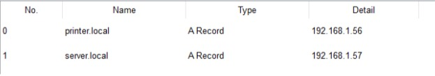
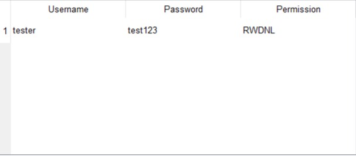
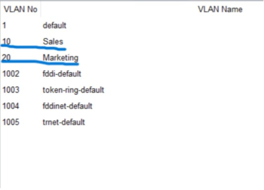

# Initial Setup

- Cisco 1941 Router → Switch
    - Connected GigabitEthernet0/0 → FastEthernet0/1 on switch.

- Office Equipment → Switch
    - All PCs, printers, and other devices are connected except for the laptop.

- Wireless Router (WRT300N) → Switch

    Two options:

  1. Router Mode (Separate Subnet)

        - Connect WAN port → switch

        - WRT300N acts as router + DHCP server

        - Creates a separate subnet (e.g., 192.168.2.x)

    2. Access Point Mode (Same Subnet)

        - Connect LAN port → switch

       - Disable DHCP
    
       - Assign static IP (e.g., 192.168.1.2)

       - Extends the main network without routing

I decided the WRT300N router would be an access point. 


# Assign IP Addresses & Configure Subnetting

- Cisco 1941 Router → Switch

    - Interface: GigabitEthernet0/0 → Switch FastEthernet0/1

    - IPv4 Address: 192.168.1.1 (Class C private IP)

    - Subnet Mask: 255.255.255.0

    - CLI Command: no shutdown (enable interface)

Role: Default gateway for all devices on the 192.168.1.0/24 network


- After setting up the router, I manually assigned each device:
    - its own IP
    - the subnet mask
    - the default gateway of the 1941 router.

| Device   | IP Address     | Subnet Mask      | Default Gateway |
|----------|---------------|----------------|----------------|
| PC 0     | 192.168.1.10  | 255.255.255.0  | 192.168.1.1    |
| PC 1     | 192.168.1.11  | 255.255.255.0  | 192.168.1.1    |
| PC 2     | 192.168.1.12  | 255.255.255.0  | 192.168.1.1    |
| PC 3     | 192.168.1.13  | 255.255.255.0  | 192.168.1.1    |
| PC 4     | 192.168.1.14  | 255.255.255.0  | 192.168.1.1    |
| Printer  | 192.168.1.20  | 255.255.255.0  | 192.168.1.1    |
| Server   | 192.168.1.100 | 255.255.255.0  | 192.168.1.1    |

- Interface of PC0


With everything set up, I need to:
- Verify that all devices can communicate with the default gateway (Cisco 1941 router) and the printer.  
- Method: Used the `ping` command from each PC to test connectivity.

PC0 pinging the router:

```
ping 192.168.1.1

Pinging 192.168.1.1 with 32 bytes of data:
Request timed out.
Request timed out.
Reply from 192.168.1.1: bytes=32 time<1ms TTL=255
Reply from 192.168.1.1: bytes=32 time=4ms TTL=255

Ping statistics for 192.168.1.1:
    Packets: Sent = 4, Received = 2, Lost = 2 (50% loss),
Approximate round trip times in milli-seconds:
    Minimum = 0ms, Maximum = 4ms, Average = 2ms
```

# Wireless Router/Access Point Configuration

- Mode: Access Point (LAN interface)  
- IP Address: 192.168.1.2  
- Subnet Mask: 255.255.255.0  
- Default Gateway: 192.168.1.1  
- DHCP: Disabled (configured via GUI)

- SSID: Office Wifi  
- Security: WPA2-PSK (WPA2 Personal)  
- Password: @OfficeProject


- Verification:
  - Connected the laptop to the wireless network using the SSID and password.  
  - Confirmed connectivity to the main network.

 

# DHCP Configuration

1. Initial DHCP Configuration

```
Router> enable
Router# configure terminal
Router(config)# ip dhcp pool OfficePool
Router(dhcp-config)# network 192.169.1.0 255.255.255.0
Router(dhcp-config)# default-router 192.169.1.1
Router(dhcp-config)# dns-server 8.8.8.8
Router(config)# ip dhcp excluded-address 192.168.1.1 192.168.1.49
Router(config)# end
Router# write memory
```
- Created a DHCP pool.
- Set the default gateway (router).
- Added Google DNS (8.8.8.8).
- Excluded static IP range (192.168.1.1 – 192.168.1.49).

When I tried switching PC0 to DHCP I encountered an error:

Issue: Devices received an APIPA address (169.254.x.x), meaning DHCP failed.
Cause: I mistakenly entered 192.169.x.x instead of 192.168.x.x.

2. Correcting the configuration

Router> enable
Router# configure terminal
Router(config)# ip dhcp excluded-address 192.168.1.1 192.168.1.49
Router(config)# ip dhcp pool OfficePool
Router(dhcp-config)# network 192.168.1.0 255.255.255.0
Router(dhcp-config)# default-router 192.168.1.1
Router(dhcp-config)# dns-server 8.8.8.8
Router(dhcp-config)# exit
Router(config)# end
Router# write memory

- Corrected network/subnet.
- DHCP now assigns addresses correctly.
- Verified with PC0 (received 192.168.1.51) and confirmed connectivity via ping 192.168.1.1.
```
C:\>ping 192.168.1.1

Pinging 192.168.1.1 with 32 bytes of data:

Reply from 192.168.1.1: bytes=32 time<1ms TTL=255
Reply from 192.168.1.1: bytes=32 time<1ms TTL=255
Reply from 192.168.1.1: bytes=32 time<1ms TTL=255
Reply from 192.168.1.1: bytes=32 time<1ms TTL=255

Ping statistics for 192.168.1.1:
    Packets: Sent = 4, Received = 4, Lost = 0 (0% loss),
Approximate round trip times in milli-seconds:
    Minimum = 0ms, Maximum = 0ms, Average = 0ms
```

# Network Services on the Server

## DNS Service

1. Configuration

Enabled the DNS service on the server.

- Added DNS entries:
- server.local → 192.168.1.57
- printer.local → 192.168.1.56



2. Initial Testing

C:\> ping server.local
Ping request could not find host server.local.

To resolve it, I did:
```
nslookup server.local

Server: [8.8.8.8]
Address:  8.8.8.8
DNS request timed out.
	timeout was 15000 milli seconds.
DNS request timed out.
	timeout was 15000 milli seconds.
DNS request timed out.
	timeout was 15000 milli seconds.
*** Request to 8.8.8.8 timed-out
```
- PC was attempting to query Google’s DNS (8.8.8.8), which doesn’t resolve internal network addresses.

3. Fix: 

- Updated DHCP on Cisco 1941 router to provide the internal DNS server:

```
Router> enable
Router# configure terminal
Router(config)# ip dhcp pool OfficePool
Router(dhcp-config)# dns-server 192.168.1.57
Router(dhcp-config)# end
Router# write memory
```

4. Verification
```
C:\>ping server.local
Pinging 192.168.1.57 with 32 bytes of data:
Reply from 192.168.1.57: bytes=32 time<1ms TTL=128
Reply from 192.168.1.57: bytes=32 time=3ms TTL=128
Reply from 192.168.1.57: bytes=32 time<1ms TTL=128
Reply from 192.168.1.57: bytes=32 time<1ms TTL=128
Ping statistics for 192.168.1.57:
Packets: Sent = 4, Received = 4, Lost = 0 (0% loss),
Approximate round trip times in milli-seconds:
Minimum = 0ms, Maximum = 3ms, Average = 0ms
```
```
C:\>ping printer.local
Pinging 192.168.1.56 with 32 bytes of data:
Reply from 192.168.1.56: bytes=32 time=1ms TTL=128
Reply from 192.168.1.56: bytes=32 time<1ms TTL=128
Reply from 192.168.1.56: bytes=32 time<1ms TTL=128
Reply from 192.168.1.56: bytes=32 time<1ms TTL=128
Ping statistics for 192.168.1.56:
Packets: Sent = 4, Received = 4, Lost = 0 (0% loss),
Approximate round trip times in milli-seconds:
Minimum = 0ms, Maximum = 1ms, Average = 0ms
```

## FTP (File Transfer Protocol) Service

1. Configuration

- Enabled FTP service on the server.

- Created user account and configured permissions.



2. Testing FTP

```
C:\> ftp 192.168.1.57
Trying to connect...192.168.1.57
Connected to 192.168.1.57
220- Welcome to PT Ftp server
Username: tester
331- Username ok, need password
Password: ****
230- Logged in
ftp>
```
- Successfully connected, verifying FTP service is functional.

# VLAN (Static Configuration)

1: Configure VLANs on the Switch

- Created two VLANs:

	- Sales: VLAN 10

	- Marketing: VLAN 20



2. Assign switch ports to VLANs

```
# Sales Department (VLAN 10)
Switch(config)#interface range fastEthernet 0/2 - 4
Switch(config-if-range)#switchport mode access
Switch(config-if-range)#switchport access vlan 10
Switch(config-if-range)#exit

# Marketing Department (VLAN 20)
Switch(config)#interface range fastEthernet 0/5 - 6
Switch(config-if-range)#switchport mode access
Switch(config-if-range)#switchport access vlan 20
Switch(config-if-range)#exit
```

3. Configure Inter-VLAN Routing

1.  Configure Switch Trunk Port

```
Switch(config)#interface gigabitEthernet 0/1
Switch(config-if)#switchport mode trunk

Switch(config-if)#
%LINEPROTO-5-UPDOWN: Line protocol on Interface GigabitEthernet0/1, changed state to down

%LINEPROTO-5-UPDOWN: Line protocol on Interface GigabitEthernet0/1, changed state to up
```

2. Configure Router Subinterfaces

| VLAN | Subinterface | IP Address   | Subnet        |
| ---- | ------------ | ------------ | ------------- |
| 10   | Gi0/0.10     | 192.168.10.1 | 255.255.255.0 |
| 20   | Gi0/0.20     | 192.168.20.1 | 255.255.255.0 |

- VLAN 10 

```
Router>enable
Router#configure terminal
Router(config)#interface gigabitethernet 0/0.10
Router(config-subif)#encapsulation dot1Q 10
Router(config-subif)#ip address 192.168.10.1 255.255.255.0
Router(config-subif)#exit
%LINK-5-CHANGED: Interface GigabitEthernet0/0.10, changed state to up
%LINEPROTO-5-UPDOWN: Line protocol on Interface GigabitEthernet0/0.10, changed state to up
```

VLAN 20
```
Router(config)#interface gigabitEthernet 0/0.20
Router(config-subif)#encapsulation dot1Q 20
Router(config-subif)#ip address 192.168.20.1 255.255.255.0
Router(config-subif)#exit
%LINK-5-CHANGED: Interface GigabitEthernet0/0.20, changed state to up
%LINEPROTO-5-UPDOWN: Line protocol on Interface GigabitEthernet0/0.20, changed state to up
```

4: Configure PCs & Connectivity Testing

1. Manually assign IP addresses and default gateways

| PC  | Port   | VLAN | IP Address      | Subnet Mask      | Default Gateway |
|-----|--------|------|----------------|----------------|----------------|
| PC0 | Fa0/2  | 10   | 192.168.10.10  | 255.255.255.0  | 192.168.10.1   |
| PC1 | Fa0/3  | 10   | 192.168.10.11  | 255.255.255.0  | 192.168.10.1   |
| PC2 | Fa0/4  | 10   | 192.168.10.12  | 255.255.255.0  | 192.168.10.1   |
| PC3 | Fa0/5  | 20   | 192.168.20.10  | 255.255.255.0  | 192.168.20.1   |
| PC4 | Fa0/6  | 20   | 192.168.20.11  | 255.255.255.0  | 192.168.20.1   |

2. Connectivity Testing 

- Intra-VLAN Communication
  - VLAN 10 (Sales Department): All PCs successfully communicated with each other.  
  - VLAN 20 (Marketing Department): All PCs successfully communicated with each other.

- Inter-VLAN Communication
  - Sales and Marketing PCs successfully communicated across VLANs, confirming proper inter-VLAN routing and default gateway configuration.

3. Connect Additional Devices and Test Connectivity

Connect the Laptop to VLAN 20 (Marketing Department)

- Laptop connected via wireless router on switch port Fa0/7, configured in access mode for VLAN 20.  
- Manually assigned IP settings:  
  - IP Address: 192.168.20.55  
  - Subnet Mask: 255.255.255.0  
  - Default Gateway: 192.168.20.1  

- Connectivity Tests:
  - Ping to Marketing Department PC (192.168.20.10): Successful  
  - Ping to Sales Department PC (192.168.10.10): Successful  

4. Connect Office Printer to VLAN 10 (Sales Department)

- Printer connected to switch port Fa0/8, configured in access mode for VLAN 10.  
- Assigned IP settings:  
  - IP Address: 192.168.10.50  
  - Subnet Mask: 255.255.255.0  
  - Default Gateway: 192.168.10.1  

- Connectivity Test: 
  - Ping from Sales Department PC: Successful


# VLAN (DHCP Configuration)

1. Exclude IP addresses from DHCP pools
- Prevent the router from assigning IPs that are already statically assigned

```
Router(config)#ip dhcp excluded-address 192.168.10.1 192.168.10.49
Router(config)#ip dhcp excluded-address 192.168.20.1 192.168.20.49
```

2. Create a DHCP pool for each VLAN


```
Router(config)#ip dhcp pool VLAN10
Router(dhcp-config)#network 192.168.10.0 255.255.255.0
Router(dhcp-config)#default-router 192.168.10.1
Router(dhcp-config)#dns-server 8.8.8.8

Router(config)#ip dhcp pool VLAN20
Router(dhcp-config)#network 192.168.20.0 255.255.255.0
Router(dhcp-config)#default-router 192.168.20.1
Router(dhcp-config)#dns-server 8.8.8.8

Router(dhcp-config)#end
Router#
%SYS-5-CONFIG_I: Configured from console by console
```

3.  Switched all devices to DHCP & tested the connection

- Verified that all devices obtained the correct IP Addresses

- All devices were able to communicate with other devices in their VLAN and across VLANs:  
	- Ping from VLAN 20 device to VLAN 20 device: Successful  
	- Ping from VLAN 20 device to VLAN 10 device: Successful  
	- Initial ping to 192.168.20.50 had one packet loss, but subsequent tests were successful, confirming stable connectivity.  

4. Configure DHCP to Use Office DNS Server

1. Change the DNS server for VLAN 10 

```
Router#enable
Router#configure terminal
Router(config)#ip dhcp pool VLAN10
Router(dhcp-config)#dns-server 192.168.1.57
```

2. Change the DNS Server for VLAN 20

```
Router(config)#ip dhcp pool VLAN20
Router(dhcp-config)#dns-server 192.168.1.57
Router(dhcp-config)#exit
```

5: Configure VLAN for Office Server

1. Create VLAN 25 on the switch
- VLAN ID: 25  
- Name: OfficeServer  
- Assign switch port Fa0/9 (connected to the server) to VLAN 25 in access mode.

2. Create a Subinterface for VLAN 25 on the router

```
Router>enable
Router#configure terminal
Router(config)#interface gigabitEthernet 0/0.25
Router(config-subif)#encapsulation dot1Q 25
Router(config-subif)#ip address 192.168.25.1 255.255.255.0
Router(config-subif)#no shutdown
Router(config-subif)#exit
```

6: Configure DHCP for Office Server VLAN (VLAN 25)

1. Exclude IP addresses from the DHCP pool
- Prevent the router from assigning addresses reserved for the server or other static devices:

```
Router#enable
Router#configure terminal
Router(config)#ip dhcp excluded-address 192.168.25.1 192.168.25.10
```

2. Create a DHCP pool for VLAN 25

```
Router(config)#ip dhcp pool VLAN25
Router(dhcp-config)#network 192.168.25.0 255.255.255.0
Router(dhcp-config)#default-router 192.168.25.1
Router(dhcp-config)#dns-server 8.8.8.8
Router(dhcp-config)#exit
Router(config)#end
Router#write memory
```

7: Test Office Server and Update DNS Settings

- Verify connectivity to Office Server (VLAN 25)
  - Ping from a PC to the server (192.168.25.11) was successful.
  - Confirms network connectivity and DHCP assignment.

- Update DNS settings in VLAN DHCP pools
  - VLAN 10 and VLAN 20 DHCP pools updated to use the internal office server as DNS:

```
Router#configure terminal
Router(config)#ip dhcp pool VLAN10
Router(dhcp-config)#dns-server 192.168.25.11
Router(dhcp-config)#ip dhcp pool VLAN20
Router(dhcp-config)#dns-server 192.168.25.11
Router(dhcp-config)#end
```

Encountered issue:

- Cause: Initial ping to printer.local failed because devices were still using Google DNS (8.8.8.8).

- Fix: Resolved by manually releasing and renewing IP addresses on each PC and power-cycling the printer.

- Pinged internal hostnames to verify resolution:
	- server.local: Successful
	- printer.local: Successful
