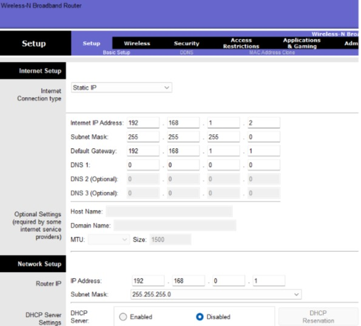
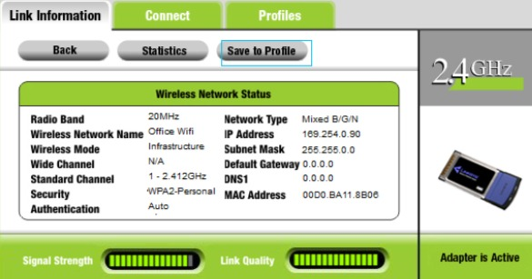

# Initial Setup

- Cisco 1941 Router → Switch
    - Connected GigabitEthernet0/0 → FastEthernet0/1 on switch.

- Office Equipment → Switch
    - All PCs, printers, and other devices are connected except for the laptop.

- Wireless Router (WRT300N) → Switch

    Two options:

  1. Router Mode (Separate Subnet)

        - Connect WAN port → switch

        - WRT300N acts as router + DHCP server

        - Creates a separate subnet (e.g., 192.168.2.x)

    2. Access Point Mode (Same Subnet)

        - Connect LAN port → switch

       - Disable DHCP
    
       - Assign static IP (e.g., 192.168.1.2)

       - Extends the main network without routing

I decided the WRT300N router would be an access point. 


# Assign IP Addresses & Configure Subnetting

- Cisco 1941 Router → Switch

    - Interface: GigabitEthernet0/0 → Switch FastEthernet0/1

    - IPv4 Address: 192.168.1.1 (Class C private IP)

    - Subnet Mask: 255.255.255.0

    - CLI Command: no shutdown (enable interface)

Role: Default gateway for all devices on the 192.168.1.0/24 network


- After setting up the router, I manually assigned each device:
    - its own IP
    - the subnet mask
    - the default gateway of the 1941 router.

| Device   | IP Address     | Subnet Mask      | Default Gateway |
|----------|---------------|----------------|----------------|
| PC 0     | 192.168.1.10  | 255.255.255.0  | 192.168.1.1    |
| PC 1     | 192.168.1.11  | 255.255.255.0  | 192.168.1.1    |
| PC 2     | 192.168.1.12  | 255.255.255.0  | 192.168.1.1    |
| PC 3     | 192.168.1.13  | 255.255.255.0  | 192.168.1.1    |
| PC 4     | 192.168.1.14  | 255.255.255.0  | 192.168.1.1    |
| Printer  | 192.168.1.20  | 255.255.255.0  | 192.168.1.1    |
| Server   | 192.168.1.100 | 255.255.255.0  | 192.168.1.1    |

- Interface of PC0


With everything set up, I need to:
- Verify that all devices can communicate with the default gateway (Cisco 1941 router) and the printer.  
- Method: Used the `ping` command from each PC to test connectivity.

PC0 pinging the router:

```
ping 192.168.1.1

Pinging 192.168.1.1 with 32 bytes of data:
Request timed out.
Request timed out.
Reply from 192.168.1.1: bytes=32 time<1ms TTL=255
Reply from 192.168.1.1: bytes=32 time=4ms TTL=255

Ping statistics for 192.168.1.1:
    Packets: Sent = 4, Received = 2, Lost = 2 (50% loss),
Approximate round trip times in milli-seconds:
    Minimum = 0ms, Maximum = 4ms, Average = 2ms
```

# Wireless Router/Access Point Configuration

- Mode: Access Point (LAN interface)  
- IP Address: 192.168.1.2  
- Subnet Mask: 255.255.255.0  
- Default Gateway: 192.168.1.1  
- DHCP: Disabled (configured via GUI)

- SSID: Office Wifi  
- Security: WPA2-PSK (WPA2 Personal)  
- Password: @OfficeProject



- Verification:
  - Connected the laptop to the wireless network using the SSID and password.  
  - Confirmed connectivity to the main network.

 

# DHCP Configuration

1. Initial DHCP Configuration

```
Router> enable
Router# configure terminal
Router(config)# ip dhcp pool OfficePool
Router(dhcp-config)# network 192.169.1.0 255.255.255.0
Router(dhcp-config)# default-router 192.169.1.1
Router(dhcp-config)# dns-server 8.8.8.8
Router(config)# ip dhcp excluded-address 192.168.1.1 192.168.1.49
Router(config)# end
Router# write memory
```
- Created a DHCP pool.
- Set the default gateway (router).
- Added Google DNS (8.8.8.8).
- Excluded static IP range (192.168.1.1 – 192.168.1.49).

When I tried switching PC0 to DHCP I encountered an error:

Issue: Devices received an APIPA address (169.254.x.x), meaning DHCP failed.
Cause: I mistakenly entered 192.169.x.x instead of 192.168.x.x.

2. Correcting the configuration

Router> enable
Router# configure terminal
Router(config)# ip dhcp excluded-address 192.168.1.1 192.168.1.49
Router(config)# ip dhcp pool OfficePool
Router(dhcp-config)# network 192.168.1.0 255.255.255.0
Router(dhcp-config)# default-router 192.168.1.1
Router(dhcp-config)# dns-server 8.8.8.8
Router(dhcp-config)# exit
Router(config)# end
Router# write memory

- Corrected network/subnet.
- DHCP now assigns addresses correctly.
- Verified with PC0 (received 192.168.1.51) and confirmed connectivity via ping 192.168.1.1.
```
C:\>ping 192.168.1.1

Pinging 192.168.1.1 with 32 bytes of data:

Reply from 192.168.1.1: bytes=32 time<1ms TTL=255
Reply from 192.168.1.1: bytes=32 time<1ms TTL=255
Reply from 192.168.1.1: bytes=32 time<1ms TTL=255
Reply from 192.168.1.1: bytes=32 time<1ms TTL=255

Ping statistics for 192.168.1.1:
    Packets: Sent = 4, Received = 4, Lost = 0 (0% loss),
Approximate round trip times in milli-seconds:
    Minimum = 0ms, Maximum = 0ms, Average = 0ms
```

# Network Services on the Server

## DNS Service

1. Configuration

Enabled the DNS service on the server.

- Added DNS entries:
- server.local → 192.168.1.57
- printer.local → 192.168.1.56


