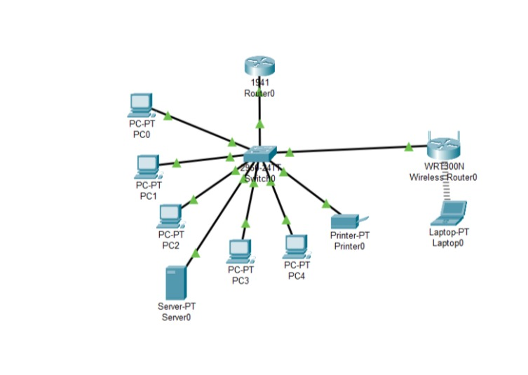
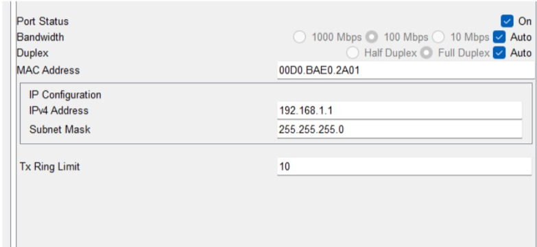
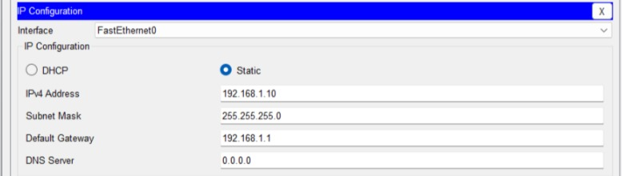

# Initial

- Cisco 1941 Router → Switch
    - Connected GigabitEthernet0/0 → FastEthernet0/1 on switch.

- Office Equipment → Switch
    - All PCs, printers, and other devices are connected except for the laptop.

- Wireless Router (WRT300N) → Switch

    Two options:

  1. Router Mode (Separate Subnet)

        - Connect WAN port → switch

        - WRT300N acts as router + DHCP server

        - Creates a separate subnet (e.g., 192.168.2.x)

    2. Access Point Mode (Same Subnet) 

        - Connect LAN port → switch

       - Disable DHCP
    
       - Assign static IP (e.g., 192.168.1.2)

       - Extends the main network without routing

I decided the WRT300N router would be an access point. 

# Assign IP Addresses & Configure Subnetting

- Cisco 1941 Router → Switch

    - Interface: GigabitEthernet0/0 → Switch FastEthernet0/1

    - IPv4 Address: 192.168.1.1 (Class C private IP)

    - Subnet Mask: 255.255.255.0

    - CLI Command: no shutdown (enable interface)

Role: Default gateway for all devices on the 192.168.1.0/24 network

Learning Note:
- 192.168.1.1 is a Class C private IP address. The router is usually assigned the first IP address, and other devices receive addresses such as 192.168.10, etc. I learned that Class C is more common (many consumer routers use this range by default) since it provides 254 usable IP addresses, which is plenty for most small offices/home networks. While using another class, like A, is possible, it’ll waste IPs. You get a huge number of IP addresses (over 16 million usable in 10.0.0.0/8), which is overkill for a small office.

# Static Network Setup

- Manually assigned each device:
    - its own IP
    - the subnet mask
    - the default gateway of the 1941 router.

| Device   | IP Address     | Subnet Mask      | Default Gateway |
|----------|---------------|----------------|----------------|
| PC 0     | 192.168.1.10  | 255.255.255.0  | 192.168.1.1    |
| PC 1     | 192.168.1.11  | 255.255.255.0  | 192.168.1.1    |
| PC 2     | 192.168.1.12  | 255.255.255.0  | 192.168.1.1    |
| PC 3     | 192.168.1.13  | 255.255.255.0  | 192.168.1.1    |
| PC 4     | 192.168.1.14  | 255.255.255.0  | 192.168.1.1    |
| Printer  | 192.168.1.20  | 255.255.255.0  | 192.168.1.1    |
| Server   | 192.168.1.100 | 255.255.255.0  | 192.168.1.1    |

- Interface of PC0

